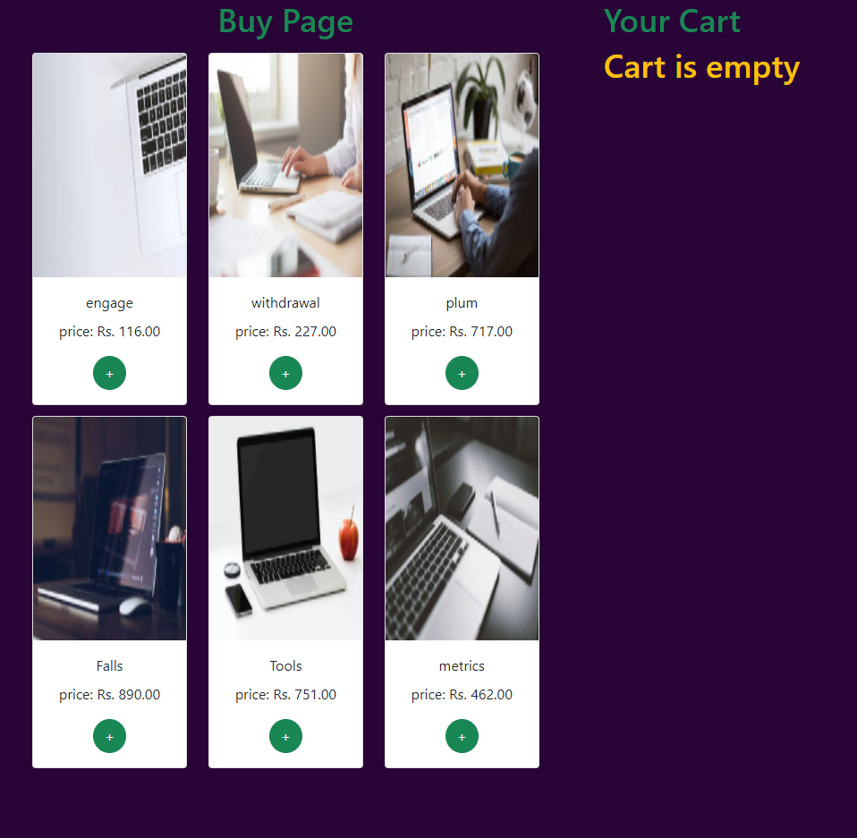
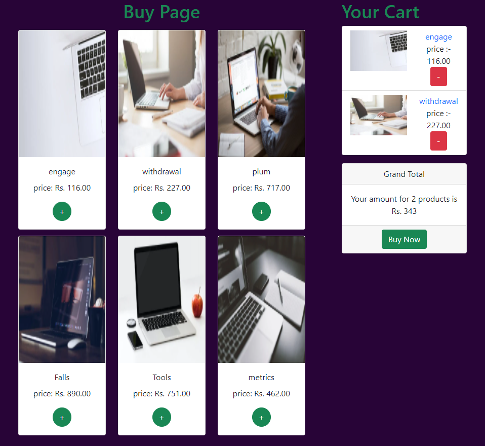
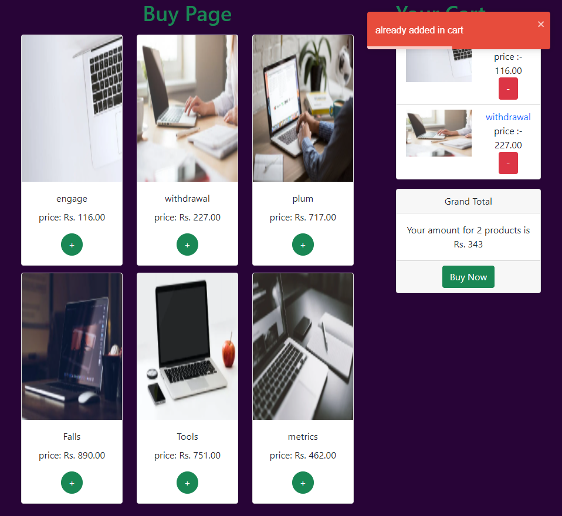
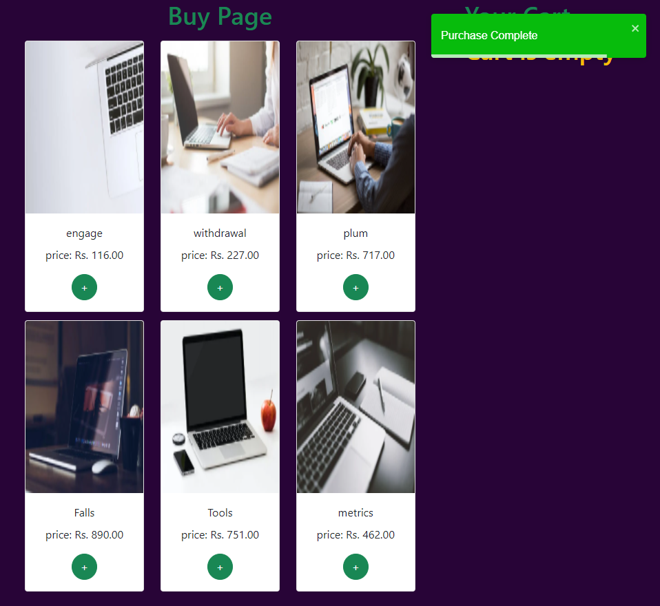

# Shopping Cart

## Check out the Application Here : [Click Here](https://deepbaran.github.io/ShoppingCart/)

## This is a Shopping Cart Application built using React.js and React Hooks.

### This application is built using:

- React.js
- React Hooks
- Context API
- JSX

### Libraries used:

- [React-Toastify](https://www.npmjs.com/package/react-toastify)
- [reactstrap](https://www.npmjs.com/package/reactstrap)
- [faker.js](https://www.npmjs.com/package/faker)

The data used in the application is stored in PEXELS.json file inside the public directory.
